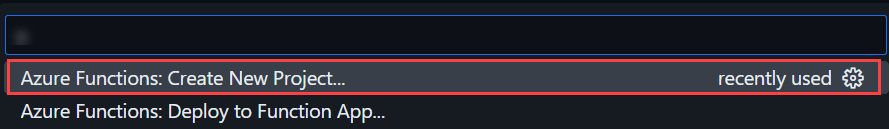

# Exercise 1: Creating a Basic AI Agent with Azure OpenAI

### Estimated Duration: 60 Minutes

## Lab Scenario

In this exercise, you'll create a basic AI Agent powered by Azure OpenAI's GPT-4 and deploy it as an API within an hour. You'll begin by understanding how AI Agents autonomously process prompts to generate intelligent responses, then build your agent using GPT-4. Next, you'll deploy the AI Agent as an Azure Function to expose it via an API, enabling easy integration with other services. Finally, you'll test the functionality of your agent using both the Python SDK and REST API to ensure it responds accurately.

## Lab Objectives

After you complete this exercise, you will:

- Understand AI Agents and how they process prompts autonomously
- Setting up the Visual Studio Code
- Deploy the AI Agent as an Azure Function with API access
- Test AI Agent Responses using REST API

## Task 1: Understand AI Agents and how they process prompts autonomously

In this read-only lab, you'll explore the fundamentals of AI Agents and understand how they autonomously process prompts to generate intelligent responses.

### What is an AI Agent?

At its core, an AI Agent is a computer program that uses artificial intelligence to interact with you in natural language. It works by taking in your words, breaking them down into smaller pieces, and then using its pre-learned knowledge to generate a response. In simple terms, it’s like having a digital assistant that can:

- **Listen to Your Input:** Capture your words whether you type or speak them.

- **Understand Your Request:** Analyze the words by breaking them down (a process called tokenization) to get the main idea.

- **Generate an Answer:** Use patterns learned from massive amounts of text to craft a response that is relevant and easy to understand.

### How Do AI Agents Process Prompts?

The journey from your input to the final answer involves several clear steps:

1. **Tokenization:** When you provide a prompt, the agent first splits your sentence into smaller parts, known as tokens. This makes it easier for the system to analyze each element of your message.

   **Example:** For the sentence "What's the weather like today?" the agent identifies key tokens like "weather" and "today."

2. **Contextual Analysis:** After tokenization, the agent examines these tokens to understand the context and intent behind your words. This step is crucial because it allows the AI to grasp the meaning, even if the phrasing is different from what it has seen before.

3. **Response Generation:** Once the meaning is clear, the AI Agent uses its trained model (like GPT-4) to predict and generate a suitable response. It pieces together the answer by considering what it has learned from a vast range of data.

4. **Delivering the Answer:** Finally, the AI Agent sends the response back to you—often in just a few seconds—making the interaction feel both natural and instantaneous.

### Real-World Use Cases of AI Agents

- **Customer Support Chatbots:** AI agents handle customer inquiries, answer FAQs, and resolve common issues 24/7, reducing wait times and improving service quality.

- **Fraud Detection in Finance:** AI agents monitor transactions in real time to identify unusual patterns and flag potential fraudulent activities, enhancing security in banking and financial services.

## Task 2: Setting up the Visual Studio Code

In this task, you will configure the visual studio code with Azure credentials and create a new project for api.

1. From the JumpVM, double click on **Visual Studio Code** icon.

1. Once the Visual Studio Code is open, on the ***Welcome*** pane, click on **Open Folder**.

   

1. Navigate to `C:\LabFiles\agent-api\` and click on **Select Folder**.

   

1. Now from the **Visual Studio Code** pane left menu, select **Azure** icon and click on **Sign in to Azure**.

   

1. In the pop up window, click om **Allow**.

   

1. Use the following credentials to sign in:

- **Useremail:**

   

- **Password:**

   

1. Once the authentication is completed, select **View** from the top menu and click on **Command Palette**.

   

1. In the command palette, search and select **Azure Functions: Create New Project**.

   

1. Now in the next step, select **agent-api** folder, where the project will be initiated.

   

1. In the **Select a language** pane, choose **Python**.

   

1. In the next pane, select **Model V2**.

   

1. 

   

