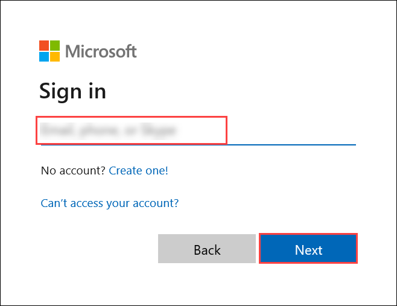

# Exercise 1: Creating a Basic AI Agent with Azure OpenAI

### Estimated Duration: 60 Minutes

## Lab Scenario

In this exercise, you'll create a basic AI Agent powered by Azure OpenAI's GPT-35-turbo and deploy it as an API within an hour. You'll begin by understanding how AI Agents autonomously process prompts to generate intelligent responses, then build your agent using GPT-35-turbo. Next, you'll deploy the AI Agent as an Azure Function to expose it via an API, enabling easy integration with other services. Finally, you'll test the functionality of your agent using both the Python SDK and REST API to ensure it responds accurately.

## Lab Objectives

After completing this exercise, you will:

- Understand AI Agents and how they process prompts autonomously
- Setting up the Visual Studio Code
- Deploy the AI Agent as an Azure Function with API access
- Test AI Agent Responses using REST API

## Task 1: Understand AI Agents and how they process prompts autonomously

In this read-only lab, you'll explore the fundamentals of AI Agents and understand how they autonomously process prompts to generate intelligent responses.

### What is an AI Agent?

At its core, an AI Agent is a computer program that uses artificial intelligence to interact with you in natural language. It works by taking in your words, breaking them down into smaller pieces, and then using its pre-learned knowledge to generate a response. In simple terms, it’s like having a digital assistant that can:

- **Listen to Your Input:** Capture your words whether you type or speak them.

- **Understand Your Request:** Analyze the words by breaking them down (a process called tokenization) to get the main idea.

- **Generate an Answer:** Use patterns learned from massive amounts of text to craft a response that is relevant and easy to understand.

### How Do AI Agents Process Prompts?

The journey from your input to the final answer involves several clear steps:

1. **Tokenization:** When you provide a prompt, the agent first splits your sentence into smaller parts, known as tokens. This makes it easier for the system to analyze each element of your message.

   **Example:** For the sentence "What's the weather like today?" the agent identifies key tokens like "weather" and "today."

2. **Contextual Analysis:** After tokenization, the agent examines these tokens to understand the context and intent behind your words. This step is crucial because it allows the AI to grasp the meaning, even if the phrasing is different from what it has seen before.

3. **Response Generation:** Once the meaning is clear, the AI Agent uses its trained model (like GPT-4) to predict and generate a suitable response. It pieces together the answer by considering what it has learned from a vast range of data.

4. **Delivering the Answer:** Finally, the AI Agent sends the response back to you—often in just a few seconds—making the interaction feel both natural and instantaneous.

### Real-World Use Cases of AI Agents

- **Customer Support Chatbots:** AI agents handle customer inquiries, answer FAQs, and resolve common issues 24/7, reducing wait times and improving service quality.

- **Fraud Detection in Finance:** AI agents monitor transactions in real time to identify unusual patterns and flag potential fraudulent activities, enhancing security in banking and financial services.

## Task 2: Setting up the Visual Studio Code

In this task, you will configure the visual studio code with Azure credentials and create a new project for api.

1. From the JumpVM, double click on **Visual Studio Code** icon.

   

1. Once the Visual Studio Code is open, select **file** from the top menu and click on **open folder**.

   

1. Navigate to `C:\code-files\agent-api\` and click on **Select Folder**.

   

1. Now from the **Visual Studio Code** pane left menu, select **Azure** icon and click on **Sign in to Azure**.

   

1. In the pop up window, click om **Allow**.

   

1. Use the following credentials to sign in:

- **Useremail:** **<inject key="AzureAdUserEmail"></inject>**

   

- **Password:** **<inject key="AzureAdUserPassword"></inject>**

   

1. In the next pane, select **No, this app only** and continue.

   

1. Once the authentication is completed, select **View** from the top menu and click on **Command Palette**.

   

1. In the command palette, search and select **Azure Functions: Create New Project**.

   

1. Now in the next step, select **agent-api** folder, where the project will be initiated.

   

1. In the **Select a language** pane, choose **Python**.

   
   
1. In the next pane, select **Model V2**.

   

1. In the next pane, select **Skip virtual environment**.

      

1. In the next pane, select **HTTP trigger** as the template to create the function.

   

1. In the input box, provide the function name as `agentapi`.

   

1. In the next pane, select **ANONYMOUS**.

   

1. Once the function is created you will be able to see the starter codefiles.

1. In the **Visual Studio Code** pane, select **function_app.py** file and replace he existing code by this:

   ```
   import azure.functions as func
   import logging
   import os
   import requests

   app = func.FunctionApp(http_auth_level=func.AuthLevel.ANONYMOUS)

   @app.route(route="agent", methods=["GET", "POST"])
   def agent(req: func.HttpRequest) -> func.HttpResponse:
      logging.info("Processing request for GPT‑4 agent.")

      # Try to get the 'message' parameter from the query string.
      user_message = req.params.get("message")
      
      # If not provided via GET, check if it's provided in the JSON body (for POST)
      if not user_message and req.method == "POST":
         try:
               req_body = req.get_json()
         except ValueError:
               return func.HttpResponse("Invalid JSON payload.", status_code=400)
         else:
               user_message = req_body.get("message")
      
      if not user_message:
         return func.HttpResponse(
               "Please provide a 'message' parameter (in the query string or request body).",
               status_code=400
         )
      
      # Retrieve your API key from the environment variables.
      api_key = os.environ.get("OPENAI_API_KEY")
      if not api_key:
         return func.HttpResponse("API key not configured.", status_code=500)
      
      # Define the Azure OpenAI endpoint URL.
      url = ("<OPENAI ENDPOINT>")
      
      headers = {
         "Content-Type": "application/json",
         "api-key": api_key
      }
      
      payload = {
         "messages": [
               {"role": "system", "content": "You are a helpful assistant."},
               {"role": "user", "content": user_message}
         ]
      }
      
      # Post the request to the OpenAI endpoint.
      response = requests.post(url, headers=headers, json=payload)
      
      if response.status_code != 200:
         logging.error(f"Error calling OpenAI API: {response.status_code} - {response.text}")
         return func.HttpResponse("Error calling OpenAI API.", status_code=response.status_code)
      
      result = response.json()
      # Extract the assistant's reply from the API response.
      assistant_reply = result.get("choices", [{}])[0].get("message", {}).get("content", "No response")
      
      return func.HttpResponse(assistant_reply, status_code=200)
   ```

   

1. Once updated use **CTRL + S** to save the updated file.

1. Select **requirement.txt** file and add **requests** package to it as shown.

   

1. Save the file once updated.

1. As you have updated the files, navigate to the Azure Portal, which you have already opened previously.

1. Once you are in the Azure Portal, scroll down and select **Resource groups** under Navigate.

   

1. From the list select **agent** resource group.

   

1. From the resource list, select **openai-<inject key="DeploymentID" enableCopy="false"/>**.

   

1. Once you are in the Azure OpenAI overview page, click on **Go to Azure Foundry portal**. You will be navigated to Azure AI Foundry Portal.

   

1. In the AI Foundry Portal, select **Deployments (1)** from the left menu and click on **gpt-35-turbo** model that is predeployed.

   

1. From the **Details** pane, copy **Target URI**, **Key** value and note these values down safely in a notepad.

   

1. From the resource list, select **agent-function-<inject key="DeploymentID" enableCopy="false"/>** function app.

   

1. From the left menu, select **Environment variables (1)** and click on **+ Add (2)**. 

   

1. In **Add/Edit application setting** pane, add **Name** as `OPENAI_API_KEY` and **Value** with the **API Key** value that you copied from AI Foundry Portal and click on **Apply**.

   

1. Again click on **Apply** to save the environment variable.

   

1. Now, navigate back to **Visual Studio Code** and open **function_app.py** file.

1. In the **function_app.py** file, update the **\<OPENAI ENDPOINT>**  value with the actual **Target URI** value that you have copied earlier and save the file.

   

### Task 3: Deploy the AI Agent as an Azure Function with API access

In this task, we will deploy our locally developed AI Agent function from Visual Studio Code to an Azure Function App, thereby making it accessible via an API endpoint. You will learn how to prepare your project for deployment, connect Visual Studio Code to your Azure account, publish your function to the cloud, and verify the deployment in the Azure Portal.

1. In the **Visual Studio Code**, select **View** from the top menu and click on **Command Palette**.

   

1. In the command palette, search and select **Azure Functions: Deploy to Function App**.

   

1. In the next pane, select function app **agent-function-<inject key="DeploymentID" enableCopy="false"/>**.

   

1. In the pop up window, click on **Deploy**.

   

1. Wait for sometime, you will see a success message once the deployment succeeds.

### Task 4: Test AI Agent Responses using REST API

In this task, we will test the deployed AI Agent API using a REST API testing tool cURL. You will configure the tool with your Azure Function App endpoint, set the necessary HTTP headers and payload, and send a test request to verify that the agent processes the input correctly and returns an appropriate response. This task ensures that your API is functioning as expected and provides a baseline for further integration and troubleshooting.

1. As you have successfully deployed agent, now its time to test it.

1. In your **JumpVM**, using the **Search** option from desktop, search and select **Git Bash**.

   

1. Once the **Git Bash** terminal is opened, run the following command. This will do a POST request to your agent function, with a prompt `tell me a joke`, for which you will get a response from your API.

   ```
   curl -X POST "https://agent-function-<inject key="DeploymentID" enableCopy="false"/>.azurewebsites.net/api/agent" \
     -H "Content-Type: application/json" \
     -d '{"message": "tell me a joke"}'
   ```

   

1. Once after pasting this, hit enter and you will get a response back with a simple joke from your API.

   

<validation step="60a5f85b-1945-49af-874d-8e75528042af" />
 
> **Congratulations** on completing the task! Now, it's time to validate it. Here are the steps:
> - Hit the Validate button for the corresponding task. If you receive a success message, you can proceed to the next task. 
> - If not, carefully read the error message and retry the step, following the instructions in the lab guide.
> - If you need any assistance, please contact us at cloudlabs-support@spektrasystems.com. We are available 24/7 to hel

## Summary

In this exercise, you have explored AI Agents, configured Visual Studio Code with Azure credentials to create an API project, deployed your AI Agent function to an Azure Function App, and tested the API using Hoppscotch.


