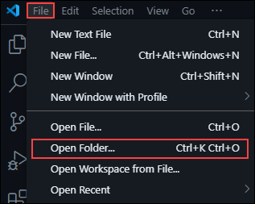
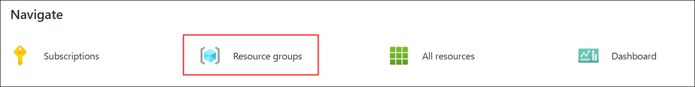
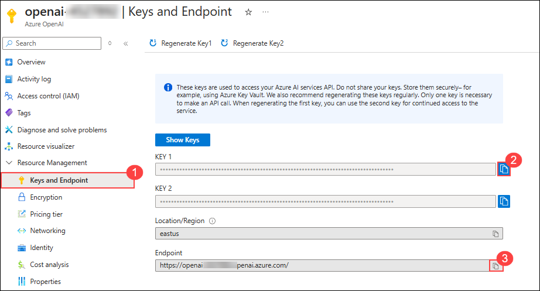

# Exercise 2: Enhancing AI Agents with Multi-Modal Capabilities

### Estimated Duration: 60 Minutes

## Lab Scenario

A multimodal AI agent is an artificial intelligence system designed to process and integrate diverse types of data—such as text, speech, and images—enabling it to understand and respond to inputs from multiple sources simultaneously. This integration allows the agent to leverage specialized models for natural language processing, speech recognition, text-to-speech synthesis, and image analysis, resulting in richer, context-aware, and more interactive user experiences.

In this exercise, you will extend an AI Agent with AI Services to process voice, images, and text. You will integrate Speech-to-Text and Text-to-Speech capabilities to enable voice-based AI interactions. Additionally, you will leverage the Computer Vision API to analyze and process images. By combining text, voice, and image inputs, you will enhance the AI Agent’s responses, making it more interactive and intelligent. Finally, you will validate the Multi-Modal AI Agent using sample inputs to ensure its effectiveness.

## Lab Objectives

After completing this exercise, you will:

- Integrate Speech-to-Text & Text-to-Speech to enable voice-based AI interactions
- Implement Computer Vision API to analyse and process images
- Setting up the codebase for Multimodal agent
- Validate Multi-Modal AI Agent with sample inputs

## Task 1: Integrate Speech-to-Text & Text-to-Speech to enable voice-based AI interactions

In this task, you will implement voice-based interactions using the Web Speech API, enabling both speech-to-text (STT) and text-to-speech (TTS) functionalities in a web application.

1. Navigate to **Visual Studio Code**, select **file** from the top menu and click on **open folder** to open multimodal code files.

   

1. In the select folder pane, navigate to `C:\code-files`, select **multimodal (1)** folder and click on **select folder (2)**. You need to implement speech recognition feature using these TODO definitions.

   

1. Once the code files are open, navigate to **App.tsx** file under **src** folder and navigate to the **TODO 1** definition.

   

1. Under the TODO 1 definition, add the below code snippet. This snippet initializes a speech recognition instance using the SpeechRecognition API, which allows the browser to convert spoken words into text.

   ```
   const SpeechRecognition = window.webkitSpeechRecognition || window.SpeechRecognition;
   const recognition = new SpeechRecognition();

   recognition.continuous = true;
   recognition.interimResults = true;
   recognition.lang = 'en-US';
   ```

1. After adding the snippet, it will look similar to this.

   

   > **Note:** Python is sensitive for indentation, please make sure that it will look similar to this

1. Now, navigate to **TODO 2** definition.

   

1. Under the TODO 2 definition, add the below code snippet. This snippet converts speech recognition results into a transcript by extracting and joining recognized text. It then updates the last chat message if it's a voice message, replacing its content with the transcribed text.

   ```
   const transcript = Array.from(event.results)
   .map(result => result[0])
   .map(result => result.transcript)
   .join('');

    // Update the last message with current transcript
    setMessages(prev => 
    prev.map((msg, idx) => 
       idx === prev.length - 1 && msg.isVoice 
          ? { ...msg, content: transcript, isProcessing: false } 
          : msg
    )
    );
   ```

1. After adding the snippet, it will look similar to this.

   

   > **Note:** Python is sensitive for indentation, please make sure that it will look similar to this

1. Now, navigate to **TODO 3** definition.

   

1. Under the TODO 3 definition, add the below code snippet. This function enables text-to-speech (TTS) using the browser’s speechSynthesis API.

   ```
   const speakText = (text: string) => {
   if ('speechSynthesis' in window) {
      // Stop any ongoing speech
      window.speechSynthesis.cancel();
      
      const utterance = new SpeechSynthesisUtterance(text);
      utterance.onstart = () => setIsSpeaking(true);
      utterance.onend = () => setIsSpeaking(false);
      utterance.onerror = () => setIsSpeaking(false);
      
      window.speechSynthesis.speak(utterance);
   }
   };
   ```

1. After adding the snippet, it will look similar to this.

   

   > **Note:** Python is sensitive for indentation, please make sure that it will look similar to this

1. Once after completing the implementation, please use **CTRL + S** to save the changes. Now you have successfully implemented the speech recognition feature for the agent.

## Task 2: Implement Computer Vision API to analyse and process images

In the previous task, you have implemented speech recognition functionality, now, In this task, you will integrate a Computer Vision API into your application to automatically analyze and process images.

1. In the **Visual Studio Code** pane, under **Explorer (1)** pane, select **app.py (2)** file under **backend** folder. Inside the file, navigate to the **TODO 1 (3)** Definition.

   

1. Under **TODO 1** definition, add the code given below. This part loads the Azure Vision API credentials from the .env file.

   ```
   vision_key = os.getenv("AZURE_VISION_KEY")
   vision_endpoint = os.getenv("AZURE_VISION_ENDPOINT")
   ```

1. After updating the code will look similar to this.

   

1. Now, navigate to **TODO 2** definition.

   

1. Under **TODO 2** definition, add the following snippet. This creates an instance of ImageAnalysisClient. The client is used to send images to Azure’s Computer Vision API for analysis.

   ```
   vision_client = ImageAnalysisClient(
    endpoint=vision_endpoint,
    credential=AzureKeyCredential(vision_key)
   )
   ```

1. After updating the code will look similar to this.

   

1. Now, navigate to **TODO 3** definition to implement image analysis endpoint.

   

1. Under **TODO 3** definition, add the following snippet. This function handles image uploads and processes them using Azure's Computer Vision API. It first validates the request, ensuring an image is provided. The uploaded image is temporarily saved and converted to binary data before being sent to Azure. The API extracts details like captions, tags, and detected objects, which are then formatted into a JSON response. If an error occurs, it logs the issue and returns an error message.

   ```
   @app.route('/api/analyze-image', methods=['POST'])
   def analyze_image():
      try:
         if 'image' not in request.files:
               return jsonify({"error": "No image provided"}), 400
         
         image_file = request.files['image']
         prompt = request.form.get('prompt', 'Describe this image in detail.')
         
         # Save image temporarily
         temp_image_path = "temp_image.jpg"
         image_file.save(temp_image_path)
         
         with open(temp_image_path, "rb") as f:
               image_data = f.read()
         
         try:
               result = vision_client.analyze(
                  image_data=image_data,
                  visual_features=[
                     VisualFeatures.CAPTION,
                     VisualFeatures.TAGS,
                     VisualFeatures.OBJECTS
                  ]
               )
            
               caption = result.caption.text if result.caption else ""
               tags = [getattr(tag, "name", str(tag)) for tag in result.tags] if result.tags else []
               objects = [getattr(obj, "name", str(obj)) for obj in result.objects] if result.objects else []
            
         except Exception as analysis_error:
               logger.error(f"Image analysis error: {str(analysis_error)}")
               return jsonify({"error": "Failed to analyze image"}), 500
   
         analysis_prompt = f"""
            Image Analysis:
            - Caption: {caption}
            - Tags: {', '.join(tags)}
            - Objects: {', '.join(objects)}
            """
         analysis_prompt += f"\n\nUser prompt: {prompt}\n\nBased on the image analysis above, please respond to the user's prompt."
         
         response = openai.ChatCompletion.create(
               engine=azure_openai_deployment,
               messages=[
                  {"role": "system", "content": "You are a helpful assistant that analyzes images."},
                  {"role": "user", "content": analysis_prompt}
               ],
               temperature=0.7,
               max_tokens=800
         )
         
         ai_message = response.choices[0].message.content
         
         os.remove(temp_image_path)
         
         return jsonify({"message": ai_message})
      
      except Exception as e:
         logger.error(f"Error in analyze-image endpoint: {str(e)}")
         if os.path.exists("temp_image.jpg"):
               os.remove("temp_image.jpg")
         return jsonify({"error": str(e)}), 500
   ```

1. After updating the code will look similar to this.

   

   > **Note:** Python is sensitive for indentation, please make sure that it will look similar to this

1. Once after updating, please use **CTRL + S** to save the file. Now you have sucessfully implemented image analysis functionality in the agent.

## Task 3: Setting up the codebase for Multimodal agent

As you have implemented all the functionality required for a multimodal agent. In this task, you will configure all the environment variables required such as endpoints and API keys and setup the environment with all the dependecies.

1. Navigate to the Azure Portal, from the home pane, select **resource groups** under **Navigate**.

   

1. From the list select **agent** resource group.

   

1. From the resource list, select **openai-<inject key="DeploymentID" enableCopy="false"/>**.

   

1. In the **Azure OpenAI** page, select **Keys and Endpoint (1)** from the left menu, under **Resource Management**. Copy **Key 1 (2)** and **Endpoint (2)** values and note it safely in a notepad, as you will use this further in this task.

   
   
   > This **Key 1** value will be `AZURE_OPENAI_KEY` and **Endpoint** value will be `AZURE_OPENAI_ENDPOINT`.

1. Now, from the resource list in the resource group pane, select **vision-<inject key="DeploymentID" enableCopy="false"/>** AI Vision resource.

     

1. In AI Vision overview page, select **Keys and Endpoint (1)** from the left menu, under **Resource Management**. Copy **Key 1 (2)** and **Endpoint (2)** values and note it safely in a notepad, as you will use this further in this task.

   

   > This **Key 1** value will be `AZURE_VISION_KEY` and **Endpoint** value will be `AZURE_VISION_ENDPOINT`.

1. Navigate back to **Visual Studio Code**. In the **Explorer (1)** pane, select **.env (2)** file under backend folder and you can see the **environment variables (3)** are declared in the file.

   

1. Update the file with the environemnt variables that you have copied earlier. Once after updating, the file will look similar to this.

   

1. Once after updating the file, use **CTRL + S** to save the changes. Now the agent is completly setup, you will be validating the agent in the next task.

## Task 4: Validate Multi-Modal AI Agent with sample inputs

In this task, you will first install all the dependencies and run the application to validate the agent with sample inputs.

1. In the **Visual Studio Code** pane, select terminal from the top menu and click on **new terminal**. This opens a powershell terminal window at bottom.

   

1. In the terminal pane, run the following command to navigate to backend folder and install requirements.

   ```
   cd backend
   pip install -r requirements.txt
   ```
   
   >This will install all the dependencies which are required to run the backend which are mentioned in the **requirements.txt** file.

1. Once after the installation is completed, run the following command to start the backend.

   ```
   python app.py
   ```

   

1. Now, as the background is running keep the terminal open and open a new terminal for further steps.

1. Select **V (1)** option and click on **Powershell (2)** from the list. This will open a new powershell terminal window.

   

1. In the terminal, run the following command to install the node modules which are required to run this appliaction.

   ```
   npm install
   ```

1. Once the installation is completed, run the following command to run the application. Copy the localhost url `http://localhost:5173/`.

   ```
   npm run dev
   ```

   

1. Navigate to your agent application from the browser, using the URL copied. The application will look similar to this.

   

1. Now you can experiment things in this application, first test the chat functionality. Use the prompt `what is AI Agent?` and click the send button. Observe that you will get a response successfully.

   

1. Now, test the image analysis functionality. Click on **Upload Image** option and navigate to `C:\code-files\multimodal\images`, where you will get some of the images for experimenting with the agent.

   

1. Select an image from the list and click on **Send Button (1)** and click on **Cancel (2)** to get a clear view of the chat area.

   

1. Now you can validate the working of image analysis by looking at the response.

   

1. Now, test the Speech recognition and text-to-speech functionality. Use the **Mic** option to talk.

   

   > **Note:** In this lab environment, the Text-to-Speech and Speech-to-Text features will not function due to the limitations of audio redirection in an RDP-over-HTTPS experience. However, you can fully experience these features by running the application on your on-premise system, where audio input and output are supported.

<validation step="f5faa2ea-4aeb-40e4-b0cc-3e6891ae64d3" />
 
> **Congratulations** on completing the task! Now, it's time to validate it. Here are the steps:
> - Hit the Validate button for the corresponding task. If you receive a success message, you can proceed to the next task. 
> - If not, carefully read the error message and retry the step, following the instructions in the lab guide.
> - If you need any assistance, please contact us at cloudlabs-support@spektrasystems.com. We are available 24/7 to hel

## Summary

In this exercise, you extended an AI Agent with AI Services to process voice, images, and text. You integrated Speech-to-Text and Text-to-Speech capabilities to enable voice-based AI interactions. Additionally, you leveraged the Computer Vision API to analyze and process images. By combining text, voice, and image inputs, you enhanced the AI Agent’s responses, making it more interactive and intelligent. Finally, you validated the Multi-Modal AI Agent using sample inputs to ensure its effectiveness.


    


