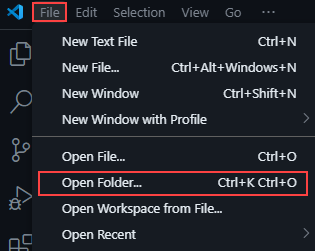
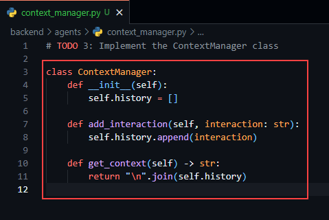
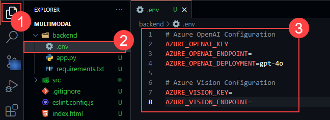
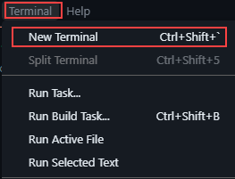
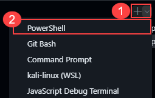
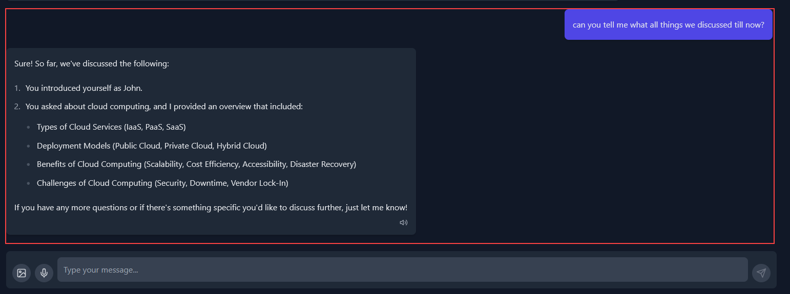

# Exercise 3: Multi-Agent Collaboration & Context Awareness

### Estimated Duration: 60 Minutes

## Lab Scenario

In this exercise, you will design an AI Orchestration Framework for multiple agents; by the end of this exercise, you will understand how to implement both a Planning Agent and an Execution Agent to process and route tasks based on user inputs.

## Lab Objectives

After completing this exercise, you will:

- Design an AI Orchestration Framework for multiple agents
- Implement context awareness and Knowledge sharing for AI Agents
- Setting up the codebase for multi-agent colloboration
- Test multi-agent collaboration with real-world scenarios

### Task 1: Design an AI Orchestration Framework for multiple agents

Modern AI applications often require handling diverse types of inputs—such as text and images—and performing specialized processing for each. To achieve this, In this task we will divide the backend into multiple agent with their distinct roles :

- **Planning Agent:** This agent is responsible for analyzing the user's input to determine the correct processing plan. It inspects if an image is provided or if the text starts with a specific prefix (e.g., "search:"), and then returns a corresponding task type ("image_analysis", "research", or defaults to "chat").

- **Execution Agent:** Once the Planning Agent determines the plan, the Execution Agent takes over to execute the task. It supports three main modes:

   - **Chat:** Uses Azure OpenAI Chat Completion to engage in a conversational task with context history.

   - **Image Analysis:** Uses the Azure Vision API to analyze images (extracting captions, tags, objects) and then passes the analysis to Azure OpenAI for generating a tailored response.

1. Navigate to **Visual Studio Code**, select **file** from the top menu and click on **open folder** to open multimodal code files.

   

1. In the select folder pane, navigate to `C:\LabFiles`, select **multi-agent (1)** folder and click on **select folder (2)**.

   

1. Once the code files are open, navigate to **agents** folder under **backend** and select **planning_agent.py** to implement planning agent.

   

1. Add the following code to complete the planning agent setup.

   ```
   def planning_agent(user_input: str, has_image: bool) -> str:

     if has_image:
         return "image_analysis"
     else:
         return "chat"
   ```
   
   > The **planning_agent** function is responsible for determining the type of task based on the user's input. It takes two parameters: a text string (user_input) and a boolean flag (has_image) that indicates whether an image was provided. The function checks if an image is present; if so, it returns "image_analysis", meaning the system should process the input as an image. If no image is provided, it defaults to returning "chat", thereby directing the system to handle the input as a text conversation. 
   
1. Once after adding the code file will look similar to this.

   

   > **Note:** Python is sensitive for indentation, please make sure that it will look similar to this

1. Once after making the changes, please use **CTRL + S** to save the file.

1. Now, select **execution_agent.py** file and navigate to **TODO 2** definition. You have to implement execution agent that will proceed with the flow, which was decided by planning agent.

   

1. Add the following code under **TODO 2** definition to complete the execution agent setup.

   ```
   def execution_agent(plan: str, user_input: str, context: str = "", image_file=None, prompt: str = "") -> str:
        if plan == "chat":
            # Build the messages including conversation history (if available)
            messages = [
                {"role": "system", "content": "You are a helpful assistant."}
            ]
            if context:
                messages.append({"role": "system", "content": f"Conversation history:\n{context}"})
            messages.append({"role": "user", "content": user_input})
            response = openai.ChatCompletion.create(
                engine=azure_openai_deployment,
                messages=messages,
                temperature=0.7,
                max_tokens=800
            )
            ai_message = response.choices[0].message.content
            return ai_message

        elif plan == "image_analysis" and image_file is not None:
            temp_image_path = "temp_image.jpg"
            image_file.save(temp_image_path)
            with open(temp_image_path, "rb") as f:
                image_data = f.read()
            try:
                result = vision_client.analyze(
                    image_data=image_data,
                    visual_features=[
                        VisualFeatures.CAPTION,
                        VisualFeatures.TAGS,
                        VisualFeatures.OBJECTS
                    ]
                )
                caption = result.caption.text if result.caption else ""
                tags = [getattr(tag, "name", str(tag)) for tag in result.tags] if result.tags else []
                objects = [getattr(obj, "name", str(obj)) for obj in result.objects] if result.objects else []
            except Exception as analysis_error:
                logger.error(f"Image analysis error: {str(analysis_error)}")
                return "Failed to analyze image"
            os.remove(temp_image_path)
            analysis_prompt = (
                f"Image Analysis:\n- Caption: {caption}\n"
                f"- Tags: {', '.join(tags)}\n"
                f"- Objects: {', '.join(objects)}\n\n"
                f"User prompt: {prompt}\n\nBased on the image analysis above, please respond to the user's prompt."
            )
            response = openai.ChatCompletion.create(
                engine=azure_openai_deployment,
                messages=[
                    {"role": "system", "content": "You are a helpful assistant that analyzes images."},
                    {"role": "user", "content": analysis_prompt}
                ],
                temperature=0.7,
                max_tokens=800
            )
            ai_message = response.choices[0].message.content
            return ai_message

        elif plan == "research":
            query = user_input.strip()[7:].strip()
            if research_agent:
                return research_agent(query)
            else:
                return "Research functionality is not available."

        else:
            return "Invalid plan or missing required input."
   ```

   > The **execution_agent** function is designed to process different types of tasks based on a given plan. It begins by checking the plan parameter: if it is set to "chat", the function builds a conversation using the provided user input and any available conversation history, then calls the Azure OpenAI Chat Completion API to generate an appropriate text response. For the "image_analysis" plan, if an image is provided, the function temporarily saves the image, reads its binary data, and passes it to the Azure Vision API. This API returns an analysis including details like a caption, tags, and recognized objects, which the function then incorporates into a prompt

1. Once after adding the code file will look similar to this.

   

   > **Note:** Python is sensitive for indentation, please make sure that it will look similar to this

1. Once after making the changes, please use **CTRL + S** to save the file. Now you have successfully divided the backend into two diffrent agent.

### Task 2: Implement context awareness and Knowledge sharing for AI Agents

In this task, you will design and develop two modules: a Knowledge Manager and a Context Manager.

- **Knowledge Manager:** The Knowledge Manager is designed as a class that serves as a simple in-memory repository for sharing information among AI agents. It uses a dictionary to store data as key-value pairs, allowing agents to add new knowledge with a specific key and later retrieve it. Additionally, it provides functionality to access the entire knowledge base. This component is critical in multi-agent systems because it ensures that every agent has access to the same pool of information, facilitating coordinated decision-making and reducing redundant processing.

- **Context Manager:** The Context Manager is implemented as a class that handles the storage of conversation history. It maintains a list where each interaction or message is appended as it occurs. In this lab, you will be using in-memory storage to store this context, but in the production envioronments, the Redis cache and NoSQL databases can be used for scalablity and persistance.

1. As you are already inside the **agents** folder in **Visual Studio Code**, select **context_manager.py** file to implement context awareness feature.

   

1. Add the following code snippet under **TODO 3** definition.

   ```
   class ContextManager:
        def __init__(self):
            self.history = []

        def add_interaction(self, interaction: str):
            self.history.append(interaction)

        def get_context(self) -> str:
            return "\n".join(self.history)
   ```

   > The **ContextManager** class provides a simple way to track the history of interactions. It initializes an empty list to store conversation entries, uses the add_interaction method to append each new interaction, and the get_context method compiles the entire conversation history into a single string by joining all entries with newline characters.

1. Once after adding, the code file will look similar to this.

   

1. Once after making the changes, please use **CTRL + S** to save the file.

1. Now, select **knowledge_manager.py** file to create a knowledge base that shares knowledge between agents.

   

1. Add the following code snippet under **TODO 4** definition to complete knowledge base setup.

   ```
   class KnowledgeManager:
        def __init__(self):
            self.knowledge_base = {}

        def add_knowledge(self, key: str, value: str):
            self.knowledge_base[key] = value

        def get_knowledge(self, key: str) -> str:
            return self.knowledge_base.get(key, "")

        def get_all_knowledge(self):
            return self.knowledge_base

   knowledge_manager = KnowledgeManager()
   ```

   > The **KnowledgeManager** class functions as a simple in-memory repository for storing and retrieving shared information. It initializes an empty dictionary (knowledge_base) to hold key-value pairs. The add_knowledge method allows agents to insert or update knowledge items, while the get_knowledge method retrieves a value based on a given key, returning an empty string if the key is not found. The get_all_knowledge method provides access to the entire knowledge base, and an instance of the class (knowledge_manager) is created for shared use across different parts of the application.

1. After adding the code snippet, the file will look similar to this.

   

1. Once after making changes, please save the file using **CTRL +S**. Now you have successfully implemented context awareness with a shared knowledge base.

### Task 3: Setting up the codebase for multi-agent colloboration

As you have implemented all the functionality required for a multi-agent setup. In this task, you will configure all the environment variables required such as endpoints and API keys and setup the environment with all the dependecies.

1. In the**Visual Studio Code's** **Explorer (1)** pane, select **.env (2)** file under backend folder and you can see the **environment variables (3)** are declared in the file.

   

1. Update the file with the environemnt variables that you have copied in the previous exercise. Once after updating, the file will look similar to this.

   

1. Once after updating the file, use **CTRL + S** to save the changes. Now the agent is completly setup, you will be validating the agent in the next task.

### Task 4: Test multi-agent collaboration with real-world scenarios

In this task, you will first install all the dependencies and run the application to validate the agent with sample inputs.

1. In the **Visual Studio Code** pane, select terminal from the top menu and click on **new terminal**. This opens a powershell terminal window at bottom.

   

1. In the terminal pane, run the following command to navigate to backend folder and install requirements.

   ```
   cd backend
   pip install -r requirements.txt
   ```
   
   >This will install all the dependencies which are required to run the backend which are mentioned in the **requirements.txt** file.

1. Once after the installation is completed, run the following command to start the backend.

   ```
   python app.py
   ```

   

1. Now, as the background is running keep the terminal open and open a new terminal for further steps.

1. Select **V (1)** option and click on **Powershell (2)** from the list. This will open a new powershell terminal window.

   

1. In the terminal, run the following command to install the node modules which are required to run this appliaction.

   ```
   npm install
   ```

1. Once the installation is completed, run the following command to run the application. Copy the localhost url `http://localhost:5173/`.

   

1. Navigate to your agent application from the browser, using the URL copied. The application will look similar to this.

   

1. Now, just give a prompt - `hello, my name is john` or you can use your name also so that after few prompts you can check if it remembers your name or not.

   

   >Experiment with some prompts.

1. Once done, just give a prompt like - `can you tell me, what all thing we discussed till now?` to validate its knowledge sharing and context awareness feature.

   

1. Now you have successfully developed a Multi-Agent AI Assistant.

## Summary

In this exercise, you have designed an AI Orchestration Framework for multiple agents, implementing both a Planning Agent to route tasks based on user inputs and an Execution Agent to process those tasks. You have also developed modules for context awareness and knowledge sharing, enabling your AI agents to maintain interaction histories and collaborate effectively through a shared repository of information.


   

   