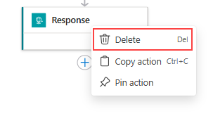

# Implementing a Customer Service Agent with Escalation Workflow 

### Estimated Duration: 90 Minutes

## Lab Scenario

In this exercise, you will implement a customer service agent that not only handles user queries but also escalates complex or urgent issues to a human operator. You will build a system that processes customer queries using an AI agent, automatically detects low-confidence or urgent responses, and triggers a real‑time notification (via Azure Logic Apps) when escalation is required. Additionally, you will integrate a simple feedback mechanism (RLHF) to collect human feedback.

## Lab Objectives

After completing this exercise, you will:

- Create a Customer Service AI Agent capable of handling user queries
- Implement an Escalation Workflow for complex queries
- Enable real-time notifications for escalation
- Integrate RLHF to improve AI decision-making through human feedback
- Validate Customer Service Agent with Escalation Workflow
- Monitor agent learning progress and refine the workflow

### Task 1: Create a Customer Service AI Agent capable of handling user queries

In this task, you will create a customer service agent that handles customer queries. It will use predefined responses for common questions, and if the query does not match any of the predefined cases, it will generate an answer using a chat completion model.

1. Navigate to **Visual Studio Code**, select **file** from the top menu and click on **open folder** to open multimodal code files.

   

1. In the select folder pane, navigate to `C:\LabFiles`, select **customer-support (1)** folder and click on **select folder (2)**.

   

1. Once the code files are open, navigate to **agents** folder under **backend** and select **faq_retriver.py** to implement planning agent.

   

1. Add the following code to complete the faq retrival setup.

   ```
    def retrieve_faq_response(query: str) -> dict:

        faq_db = {
            "hours": "Our business hours are from 9 AM to 5 PM, Monday through Friday.",
            "return policy": "You can return any item within 30 days of purchase with a receipt.",
            "shipping": "We offer free shipping on orders over $50."
        }
        
        query_lower = query.lower()
        for key, answer in faq_db.items():
            if key in query_lower:
                return {"response": answer, "confidence": 0.9}
        return None
   ```
   
   > The `retrieve_faq_response` function is responsible for looking up common queries in a predefined FAQ database. It contains a simple dictionary with keys like "hours," "return policy," and "shipping," each paired with an answer. When a query is submitted, the function converts it to lowercase and checks if it contains any of these keywords. If it finds a match, it returns the corresponding answer along with a high confidence score (0.9), which indicates that the response is reliable. If no keyword is found, it returns None, signaling that the system should fall back on generating an answer using the AI model. This simple retrieval mechanism ensures that frequently asked questions are answered quickly and accurately.
   
1. Once after adding the code file will look similar to this.

   

1. Please use **CTRL + S** to save the file.

1. From the list, select **customer_service_agent.py** to implement the logic.
 
   

1. Add the following code to complete the customer agent logic.

   ```
    import openai
    import os
    from faq_retriever import retrieve_faq_response

    def customer_service_agent(query: str) -> dict:

        faq_response = retrieve_faq_response(query)
        if faq_response is not None and faq_response.get("confidence", 0) >= 0.85:
            return faq_response

        messages = [
            {"role": "system", "content": "You are a customer service assistant."},
            {"role": "user", "content": query}
        ]
        response = openai.ChatCompletion.create(
            engine=os.getenv("AZURE_OPENAI_DEPLOYMENT"),
            messages=messages,
            temperature=0.5,
            max_tokens=500
        )
        ai_response = response.choices[0].message.content
        # Force a low confidence value (0.1) for demo purposes.
        return {"response": ai_response, "confidence": 0.1}
   ```
   
   > The `customer_service_agent` function is designed to answer customer queries. It first checks if the question matches any frequently asked questions (FAQ) using the retrieve_faq_response function. If a matching FAQ is found with high confidence (a score of 0.85 or above), the function immediately returns that answer. If no good FAQ match is found, the function creates a conversation prompt and calls the Azure OpenAI chat model to generate an answer. For demonstration purposes, we deliberately set the confidence level of this generated answer very low (0.1), so that in our lab the system can trigger an escalation process if needed. This two-step approach helps illustrate how predefined answers and AI-generated responses can work together in a customer service context.

1. Once after adding the code file will look similar to this.

   

1. Please use **CTRL + S** to save the file.

### Task 2: Implement an Escalation Workflow for complex queries

In this task, you will implement an escalation workflow that allows the agent to determine whether to respond directly to the customer or escalate the issue to human support.

1. Navigate to **backend** folder and select **escalation_workflow.py** to implement planning agent.

   

1. Add the following code to complete the escalation workflow.

   ```
    def needs_escalation(response_data: dict, query: str) -> bool:

        low_confidence = response_data.get("confidence", 1.0) < 0.7
        critical_keywords = ["complaint", "urgent", "not satisfied", "escalate", "immediate", "asap"]
        contains_critical = any(word in query.lower() for word in critical_keywords)
        return low_confidence or contains_critical

    def escalate_query(query: str, response_data: dict) -> str:

        urgent_keywords = ["urgent", "immediate", "asap"]
        if any(word in query.lower() for word in urgent_keywords):
            default_message = "Your query has been marked as urgent. A support agent will contact you immediately."
            escalation_message = f"Escalated Query (URGENT): {query}\nResponse: {default_message}"
            return escalation_message
        else:
            escalation_message = f"Escalated Query: {query}\nResponse: {response_data.get('response')}"
            return escalation_message
   ```
   
   > The first function, `needs_escalation`, takes in the AI's response data and the original query. It first checks if the AI's response has a "confidence" score less than 0.7 (with 1.0 being full confidence), meaning the response may not be reliable. It then looks for any critical keywords—such as "complaint," "urgent," "not satisfied," "escalate," "immediate," or "asap"—in the query. If either the response confidence is low or the query contains any of these keywords, the function returns True, indicating that the query should be escalated to human support.

   > The second function, `escalate_query`, builds an escalation message based on the query and the response data. It first checks if the query contains any urgent keywords (like "urgent," "immediate," or "asap"). If it does, the function creates a default urgent message stating, "Your query has been marked as urgent. A support agent will contact you immediately," and includes that in the escalation message. Otherwise, it uses the AI's generated response in the escalation message. This message is then used to notify human support that the query requires special attention.
   
1. Once after adding the code file will look similar to this.

   

1. Please use **CTRL + S** to save the file.

### Task 3: Enable real-time notifications for escalation

In this task, you will implement the notification workflow by creating an Azure Logic App flow. This flow will be triggered when a customer query is marked for escalation, and it will send an email notification to the designated support email address.

1. In **Visual Studio Code** pane, select `notification.py` file under **backend** folder. You will define the notification flow in this file.

   

1. Add the following code to setup the notification flow.

   ```
    import os
    import requests

    def send_notification_via_logic_app(escalation_message: str):
        """
        Sends a notification by triggering an Azure Logic App.
        """
        logic_app_url = os.getenv("LOGIC_APP_TRIGGER_URL")
        if not logic_app_url:
            return "Logic App trigger URL not configured."
        
        payload = {
            "subject": "Customer Service Query Escalation",
            "body": escalation_message,
            "to": os.getenv("SUPPORT_EMAIL")
        }
        
        response = requests.post(logic_app_url, json=payload)
        if response.status_code in [200, 202]:
            return "Notification sent successfully."
        else:
            return f"Failed to send notification. Status code: {response.status_code}"
   ```
   
   > This function, `send_notification_via_logic_app`, triggers an Azure Logic App by sending an HTTP POST request. It first retrieves the Logic App trigger URL and the support email address from environment variables. If the URL is not configured, the function returns an error message. It then constructs a payload with a subject, body, and recipient email, and posts this payload as JSON to the Logic App URL. If the request is successful (indicated by a status code of 200 or 202), it returns a success message; otherwise, it returns a failure message that includes the status code.

1. Once after adding the code file will look similar to this.

   

1. Please use **CTRL + S** to save the file.

### Task 4: Integrate RLHF to improve AI decision-making through human feedback

In this task, you will add a reinforcement learning component. While a full-scale system would require large amounts of data for continuous model improvement, for this lab we will implement a simple feedback collector. This collector will capture user feedback and store it in a file, demonstrating how human input can be gathered and later used to refine the AI agent's decision-making and overall performance.

1. In **Visual Studio Code** pane, select `feedback_manager.py` file under **backend** folder. You will implement a feedback collector here, which collects feed back given as positive and negetive stores it in a feedback.json file.

   

1. Add the following code to setup the notification flow.

   ```
    import json
    import os

    feedback_db = []

    # Define the file path for storing feedback
    FEEDBACK_FILE = os.path.join(os.path.dirname(__file__), "feedbacks.json")

    def load_feedbacks():
        global feedback_db
        if os.path.exists(FEEDBACK_FILE):
            with open(FEEDBACK_FILE, "r") as f:
                try:
                    feedback_db = json.load(f)
                except json.JSONDecodeError:
                    feedback_db = []
        else:
            feedback_db = []

    def save_feedbacks():
        with open(FEEDBACK_FILE, "w") as f:
            json.dump(feedback_db, f, indent=2)

    def record_feedback(query: str, ai_response: str, feedback: str):
        entry = {"query": query, "response": ai_response, "feedback": feedback}
        feedback_db.append(entry)
        save_feedbacks()  # Save the updated feedback to file
        return entry

    def get_feedback():
        load_feedbacks()  # Reload from file to ensure the latest data is returned
        return feedback_db
   ```
   
   > This module serves as a `simple feedback collector` that persists user feedback in a file. It begins by defining an in-memory list (feedback_db) and a file path (feedbacks.json) in the same directory as the module, where all feedback entries will be stored. The load_feedbacks function checks if the feedback file exists and, if so, loads its JSON contents into feedback_db. If the file is missing or the JSON is invalid, it resets the feedback database to an empty list.

   > When a user submits feedback through the system, the `record_feedback` function creates a new entry containing the original query, the AI's response, and the feedback itself, appending this entry to the in-memory list. It then calls `save_feedbacks` to write the updated feedback database to the file in a human-readable format (with indentation). Finally, the `get_feedback` function reloads the file to ensure the latest data is retrieved, returning the current list of feedback entries. This setup provides a straightforward way to capture and review user feedback for future improvements to the AI agent.

1. Once after adding the code file will look similar to this.

   

1. Please use **CTRL + S** to save the file.

1. Once the file is saved, navigate to the Azure Portal, from the home pane, select **resource groups** under **Navigate**.

   

1. From the list select **agent-<inject key="DeploymentID" enableCopy="false"/>** resource group.

   

1. From the resource list, select **openai-<inject key="DeploymentID" enableCopy="false"/>**.

   

1. In the **Azure OpenAI** page, select **Keys and Endpoint (1)** from the left menu, under **Resource Management**. Copy **Key 1 (2)** and **Endpoint (2)** values and note it safely in a notepad, as you will use this further in this task.

   
   
   > This **Key 1** value will be `AZURE_OPENAI_KEY` and **Endpoint** value will be `AZURE_OPENAI_ENDPOINT`.

1. Now from the resource list, select **logicapp-<inject key="DeploymentID" enableCopy="false"/>**.

   

1. In **Logic app** pane, select **Logic app templates (1)** from left menu and click on the option **Request-Response: Receive and respond to messages over HTTP or HTTPS (2)**.

   

1. Inside workflow pane, select **Use this template** option.

   

1. In the next pane, click on **Update**.

   

1. Once you clicked on update, you will be navigated to design pane and the flow will look similar to this.

   

1. As you are adding a connector for email, the response node is not required here. Right-Click on **Response** node and select **Delete** option to delete the node.

   

1. Once clicked on delete, a prompt will be opened. Click on **OK** to continue with the deletion.

   

1. Select **When a HTTP reuest is received (1)** node, add the below given **JSON Body (2)** under **Request Body JSON Schema** and use the **Copy (3)** option to copy the **HTTP URL** of Logic App and note it down in a notepad safely.

   

1. Once done, click on **+** and select **Add an action**.

   

1. From the list of actions, search and select **Send email with options** action under **Outlook.com**.

   

1. On the Create connection pane, click on **Sign in**.

   

1. Once done, save the logic app flow using the **Save** option from top menu.

   

### Task 5: Validate Customer Service Agent with Escalation Workflow

In this task, you'll validate customer service agent by running the application and testing it with diffrent prompts to check its flow.

1. In the Azure Portal, from the home pane, select **resource groups** under **Navigate**.

   

1. From the list select **agent-<inject key="DeploymentID" enableCopy="false"/>** resource group.

   

1. From the resource list, select **openai-<inject key="DeploymentID" enableCopy="false"/>**.

   

1. In the **Azure OpenAI** page, select **Keys and Endpoint (1)** from the left menu, under **Resource Management**. Copy **Key 1 (2)** and **Endpoint (2)** values and note it safely in a notepad, as you will use this further in this task.

   
   
   > This **Key 1** value will be `AZURE_OPENAI_KEY` and **Endpoint** value will be `AZURE_OPENAI_ENDPOINT`.

1. Once copied, navigate to **Visual Studio Code** pane and select **.env** file under backend.

   

1. Now add the copied values in the **.env** file, once added the file will look similar to this.

   

1. In the **Visual Studio Code** pane, select terminal from the top menu and click on **new terminal**. This opens a powershell terminal window at bottom.

   

1. In the terminal pane, run the following command to navigate to backend folder and install requirements.

   ```
   cd backend
   pip install -r requirements.txt
   ```
   
   >This will install all the dependencies which are required to run the backend which are mentioned in the **requirements.txt** file.

1. Once after the installation is completed, run the following command to start the backend.

   ```
   python app.py
   ```

   

1. From the terminal output, copy the URL value as shown and paste it in your browser.

   

1. Now the application running on your browser will look similar to this.

   

1. As the application is running, test out the customer service agent with some prompts.

1. First, use a prompt which will just use the **faq_retriver** file to retrive the answer.

   ```
   What is your return policy?
   ```

1. Paste the **Prompt (1)** on the area, click on **Submit Query (2)** button, once submitted a **response (3)** will shown and you can use the **Thumbs Up & Thumbs Down (4)** symbols to give the feedback as Positive or negetive.

   

1. Once you click on any of the feedback symbols, you will get a prompt, please click on **OK**.

   

1. Next, use the below prompt, which will retrive the answer using the Genrative AI capabilities.

   ```
   Can you explain how two-factor authentication works?
   ```

   

1. Now, as the agent is giving response for all the simple and general queries, use key words like `urgent`, `immediate`, `asap` to trigger the escalation workflow. This will send a notification to support email that you have provided in `.env` file.

   ```
   I need immediate assistance with my order; it's urgent!
   ```

   

1. Now, you can check that, you have received notifications to that provided email. The customer service agent is now successfully running.

### Task 6: Monitor agent learning progress and refine the workflow (Read-Only)

In this task, you will review the collected user feedback stored in the feedbacks.json file. Although we are not implementing live model retraining in this lab, you will learn how the gathered feedback data can be analyzed to assess the agent’s performance. This data provides insights into which responses are effective and which ones need improvement, forming the basis for fine-tuning the AI agent in a production environment.

1. Navigate back to ** Visual Studio Code** pane, you can see a `feedback.json` file will be created. Open the file.

1. Once the file is open, go through the file once to check how it is structured and how those are marked as positive and negetive according to the options selected.

   > After interacting with the customer service agent, user feedback (e.g., thumbs up or thumbs down) is recorded and saved in the feedbacks.json file. By opening this file, you can see a log of queries, the agent’s responses, and the corresponding feedback. In a real-world scenario, this feedback is aggregated and analyzed to identify patterns and recurring issues.

   > Such analysis helps determine whether the agent’s responses are meeting customer needs or if adjustments are necessary. The insights obtained from this review can be used to fine-tune the AI model—by retraining it with additional data or adjusting its parameters—to improve its decision-making and overall efficiency.

## Summary 

In this exercise, you implemented a customer service agent that not only handled user queries but also escalated complex or urgent issues to a human operator. You built a system that processed customer queries using an AI agent, automatically detected low-confidence or urgent responses, and triggered real‑time notifications via Azure Logic Apps when escalation was required. Additionally, you integrated a simple feedback mechanism to collect human feedback, which could later be used to fine‑tune the model and improve the agent’s performance.
  