# Monitoring AI Agents and Performance Analytics

### Estimated Duration: 30 Minutes

## Lab Scenario

In this exercise, you will learn how to monitor your AI Agents and analyze their performance using Azure Monitor and Log Analytics. You will access real-time metrics directly from your Azure resources and run basic Kusto Query Language (KQL) queries to gain insights into AI interactions and errors. This integrated approach allows you to quickly identify performance trends, troubleshoot issues, and optimize the performance of your AI solutions.

## Lab Objective

After completing this exercise, you will:

- Monitor Resource Metrics and Analyze Logs

## Task 1: Monitor Resource Metrics and Analyze Logs

In this task, you will explore resource-specific metrics via Azure Monitor and then run KQL queries in your Log Analytics workspace to analyze AI Agent interactions. This unified approach helps you gain comprehensive insights into the performance and health of your AI solutions.

1. Navigate to **Azure Portal**, Select **agent** resource group.

1. From the resource list, select **openai-<inject key="DeploymentID" enableCopy="false"/>** Azure OpenAI resource.

   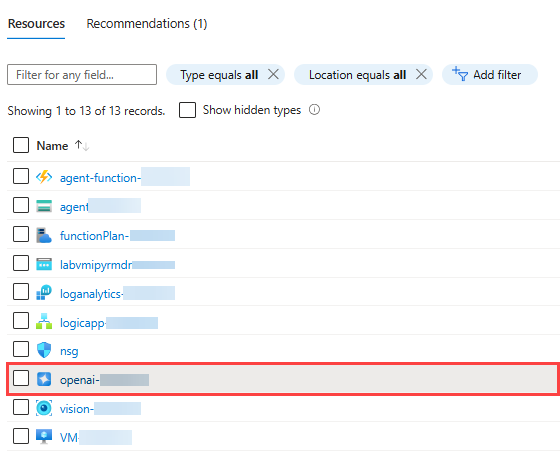

1. In the **Azure OpenAI** pane, select **Metrics** from left menu under **Monitoring**. Select **Azure OpenAI Requests**.

   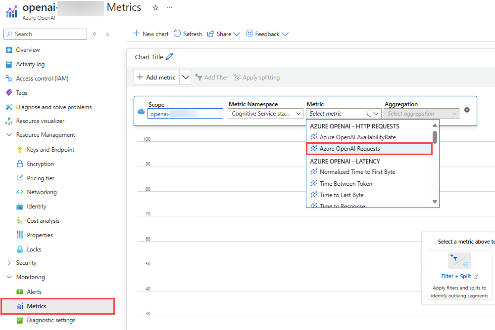

1. Once selected, check the graph. This will show the total requests made to Azure OpenAI. You can try diffrent metrics and try out the metrics capabilities.

   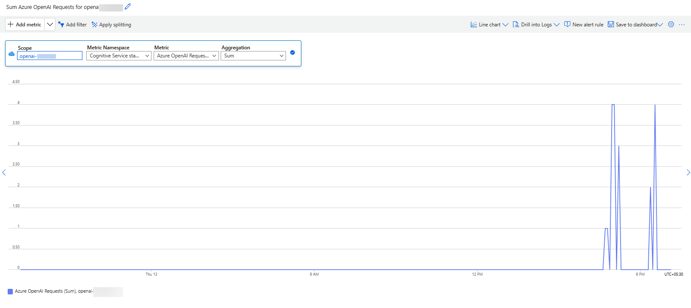

1. Once done, navigate back to resource group page, from the resource list, select **vision-<inject key="DeploymentID" enableCopy="false"/>** AI Vision service.

   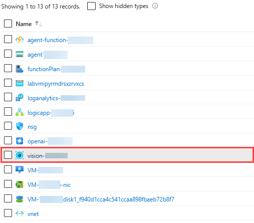

1. In the **AI Vision** pane, select **Metrics** from left menu under **Monitoring**. Select **Data In** as Metric. Observe the graph, which shows total data that is ingested by Azure AI Vision Service.

   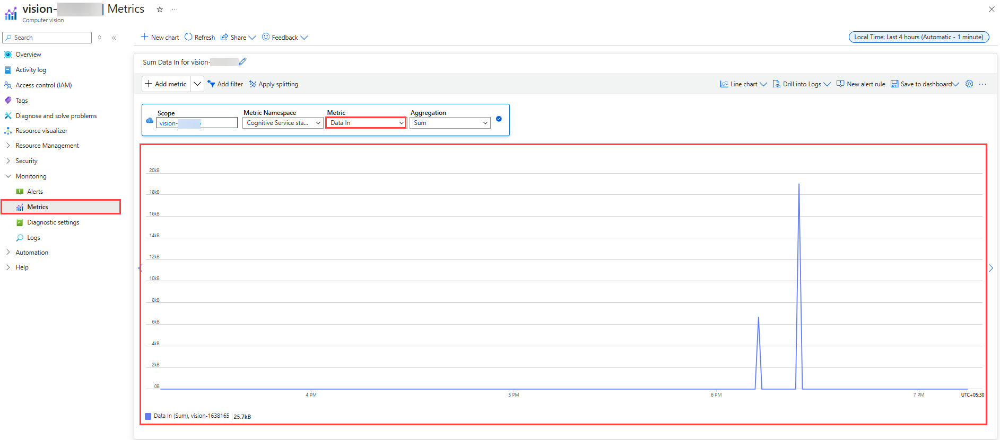

1. Once done, navigate back to resource group page, from the resource list, select **loganalytics-<inject key="DeploymentID" enableCopy="false"/>** Log Analytics Workspace.

   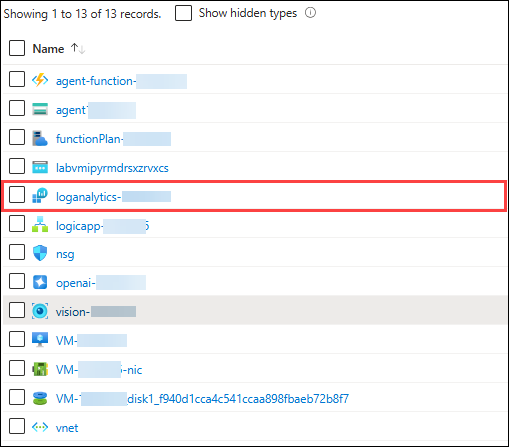

1. From **Log Anaytics Workspace** resource pane, select **Logs** from left menu and click on **x** to cancel the tutorial.

   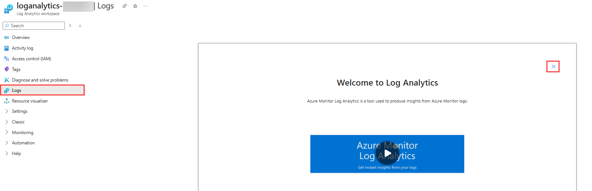

1. In the **Logs** pane, change the mode from **Simple mode** to **KQL mode**, using the option from top right menu.

   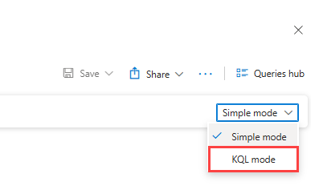

1. Now, the KQL query pane will be opened, run the following query to get the top 50 logs from Azure Diagnostic Settings.

   ```
   AzureDiagnostics
   | order by TimeGenerated desc
   | take 50
   ```

   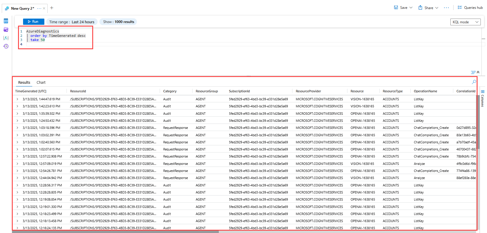

1. Once done, run the following query to check the logs which conatins **agent** keyword.

   ```
   AzureDiagnostics
   | where TimeGenerated > ago(24h)
   | where OperationName contains "agent"
   | order by TimeGenerated desc
   ```

   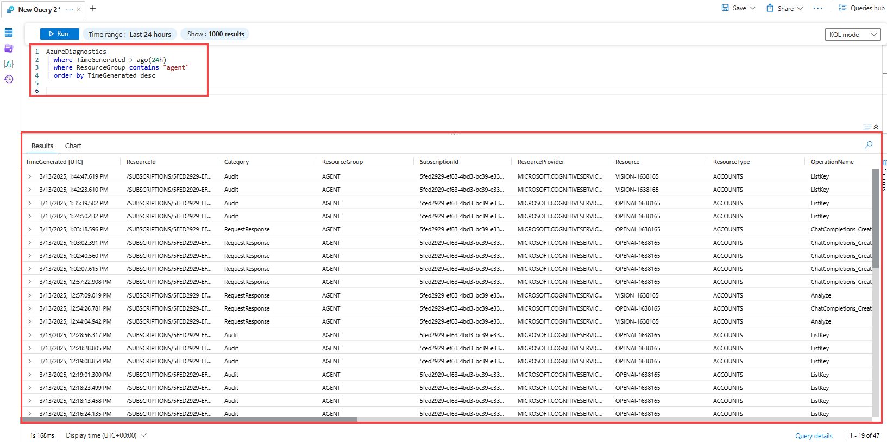

1. As you have already got the logs from Azure Diagnostic Settings, now run the following query to get the logs of **OpenAI** resource from **Allmetrics** table.

   ```
   AzureMetrics
   | where Resource contains "OpenAI"
   ```

   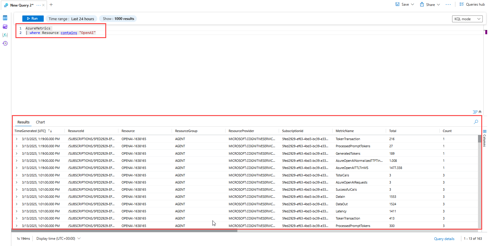

   > These are just basic examples of KQL queries and monitoring techniques that can be used to track your AI Agent workload on Azure. However, Azure Monitor and Log Analytics offer much more advanced capabilities, such as setting up real-time alerts for failures or unusual behavior, detailed performance monitoring to track latency and error patterns, and anomaly detection to identify unexpected spikes in failures or request volumes. Additionally, you can create custom dashboards for visual insights and perform correlation analysis to link AI failures with external factors like system load or API issues. By leveraging these tools, you can proactively manage and optimize your AI Agent for better efficiency, reliability, and performance.

## Summary 

In this exercise, you learned how to monitor your AI Agents and analyze their performance using Azure Monitor and Log Analytics. You accessed real-time metrics directly from your Azure resources and ran basic Kusto Query Language (KQL) queries to gain insights into AI interactions and errors. This integrated approach allowed you to quickly identify performance trends, troubleshoot issues, and optimize the performance of your AI solutions.
