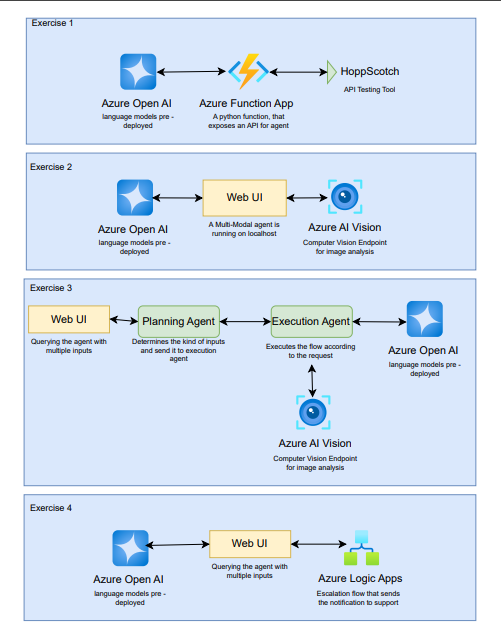
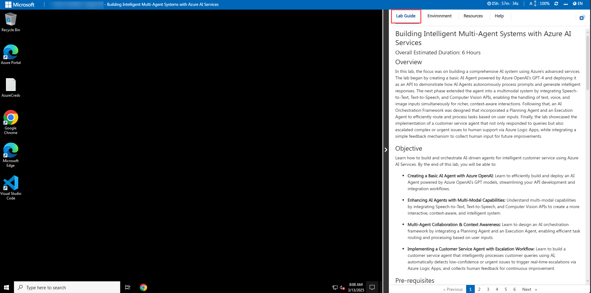
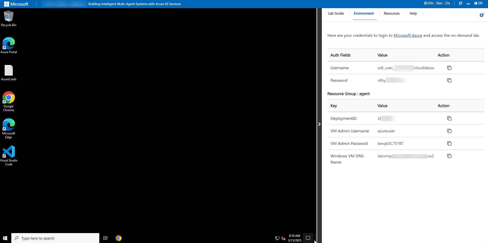
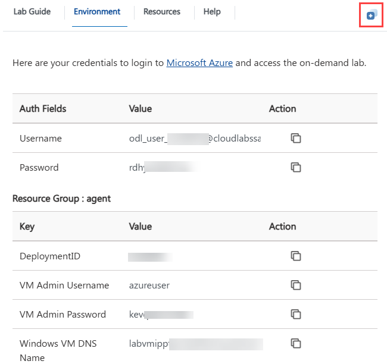
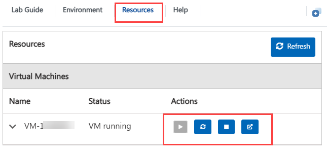
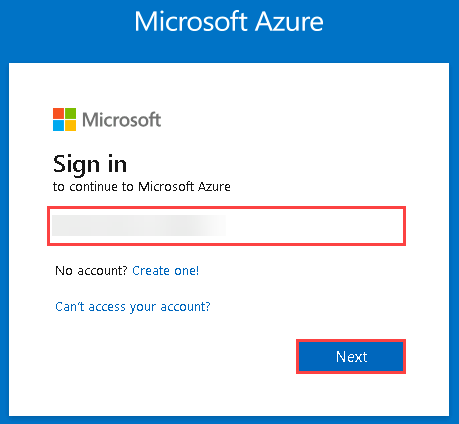
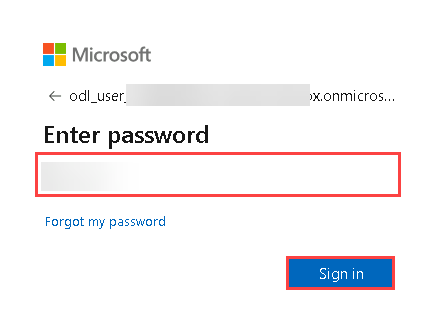

# Building Intelligent Multi-Agent Systems with Azure AI Services 

### Overall Estimated Duration: 6 Hours

## Overview

In this lab, the focus was on building a comprehensive AI system using Azure's advanced services. The lab began by creating a basic AI Agent powered by Azure OpenAI's GPT-4 and deploying it as an API to demonstrate how AI Agents autonomously process prompts and generate intelligent responses. The next phase extended the agent into a multimodal system by integrating Speech-to-Text, Text-to-Speech, and Computer Vision APIs, enabling the handling of text, voice, and image inputs simultaneously for richer, context-aware interactions. Following that, an AI Orchestration Framework was designed that incorporated a Planning Agent and an Execution Agent to efficiently route and process tasks based on user inputs. Finally, the lab showcased the implementation of a customer service agent that not only responded to queries but also escalated complex or urgent issues to human support via Azure Logic Apps, while integrating a simple feedback mechanism to collect human input for future improvements.

## Objective

Learn how to build and orchestrate AI-driven agents for intelligent customer service using Azure AI Services. By the end of this lab, you will be able to:

- **Creating a Basic AI Agent with Azure OpenAI:** Learn to efficiently build and deploy an AI Agent powered by Azure OpenAI's GPT models, streamlining your API development and integration workflows.

- **Enhancing AI Agents with Multi-Modal Capabilities:** Understand multi-modal capabilities by integrating Speech-to-Text, Text-to-Speech, and Computer Vision APIs to create a more interactive, context-aware, and intelligent system.

- **Multi-Agent Collaboration & Context Awareness:** Learn to design an AI orchestration framework by integrating a Planning Agent and an Execution Agent, enabling efficient task routing and processing based on user inputs.

- **Implementing a Customer Service Agent with Escalation Workflow:** Learn to build a customer service agent that intelligently processes customer queries using AI, automatically detects low-confidence or urgent issues to trigger real‑time escalations via Azure Logic Apps, and collects human feedback for continuous improvement.

## Pre-requisites

- **Familiarity with Azure:** Basic knowledge of Azure services and the Azure portal for managing cloud resources.

- **Basic Knowledge of Python:** Familiarity with Python programming and understand the agent workflows.

## Architecture

This architecture integrates various Azure services to create a robust, AI-driven system capable of handling complex tasks, from image analysis using Azure AI Vision to advanced natural language processing with Azure OpenAI. The system ensures efficient workflow management through components like the Planning Agent and Execution Agent, which streamline task execution based on user inputs. Additionally, Azure Logic Apps facilitate escalation flows, ensuring timely support notifications when required. Enhanced by Application Insights for performance monitoring, the architecture delivers a seamless and responsive user experience, making it a comprehensive solution for AI-powered interactions and workflows.

## Architecture Diagram

## Explanation of Components

- **Azure OpenAI:** Pre-deployed language models serve as the foundation for AI capabilities across the architecture, enabling advanced natural language processing and generation.

- **Azure Function App:** A Python-based function exposes an API for agent interactions, allowing seamless communication and integration between different components.

- **HoppScotch:** Utilized as an API testing tool, ensuring that the APIs are functioning correctly and efficiently.

- **Azure AI Vision:** Offers a computer vision endpoint for image analysis, enhancing the system's ability to process and interpret visual data.

- **Azure Logic Apps:** Manages escalation flows, sending notifications to support teams when necessary, ensuring that any issues are promptly addressed.

## Getting Started with Lab

Welcome to Building Intelligent Multi-Agent Systems with Azure AI Services Hands-On Lab ! , We've prepared a seamless environment for you to explore and learn. Let's begin by making the most of this experience.

>**Note:** If a PowerShell window appears once the environment is active, please don't close it. Minimize it instead of closing it and proceed with the tasks.

### Accessing Your Lab Environment

Once you're ready to dive in, your virtual machine and Lab guide will be right at your fingertips within your web browser.

### Exploring Your Lab Resources

To get a better understanding of your Lab resources and credentials, navigate to the Environment tab.

### Utilizing the Split Window Feature

For convenience, you can open the Lab guide in a separate window by selecting the Split Window button from the Top right corner

### Managing Your Virtual Machine

Feel free to start, stop, or restart your virtual machine as needed from the Resources tab. Your experience is in your hands!

## Let's Get Started with Azure Portal

1. In the JumpVM, click on **Azure portal** shortcut of Microsoft Edge browser which is created on desktop.

   

1. On the **Sign into Microsoft Azure** tab, you will see the login screen. Enter the provided email or username, and click **Next** to proceed.

   - Email/Username: <inject key="AzureAdUserEmail"></inject>

     

1. Now, enter the following password and click on **Sign in**.

   - Password: <inject key="AzureAdUserPassword"></inject>

     

     >**Note:** If you see the Action Required dialog box, then select Ask Later option.
     
1. If you see the pop-up **Stay Signed in?**, click No.

1. If you see the pop-up **You have free Azure Advisor recommendations!**, close the window to continue the Lab.

1. If a **Welcome to Microsoft Azure** popup window appears, click **Cancel** to skip the tour.

## Support Contact

The CloudLabs support team is available 24/7, 365 days a year, via email and live chat to ensure seamless assistance at any time. We offer dedicated support channels tailored specifically for both learners and instructors, ensuring that all your needs are promptly and efficiently addressed.Learner Support Contacts:

- **Email Support:** cloudlabs-support@spektrasystems.com
- **Live Chat Support:** https://cloudlabs.ai/labs-support

Now, click on Next from the lower right corner to move on to the next page.

## Happy Learning!!
